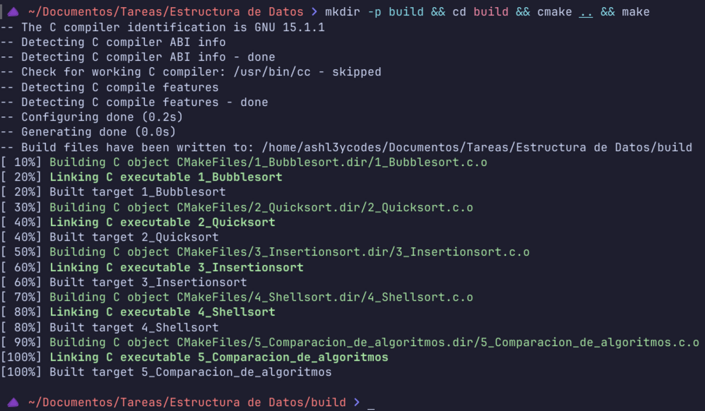
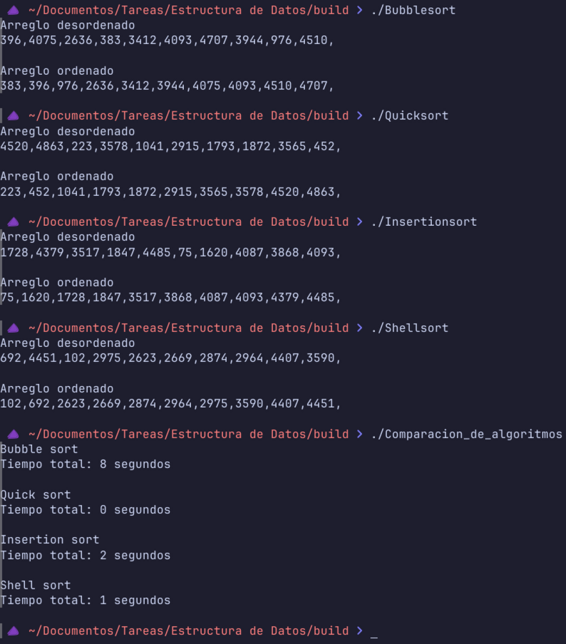

# Algoritmos de Ordenamiento

Acá se encuentran diferentes archivos que contienen algoritmos de ordenamiento, los cuales son comparados respecto al tiempo de ejecución en otro archivo.  

<details>
<summary>Estructura del proyecto</summary>

```txt
Estructura de datos/
├ 1_Bubblesort.c
├ 2_Quicksort.c
├ 3_Insertionsort.c
├ 4_Shellsort.c
├ 5_Comparacion_de_algoritmos.c
├ CMakeLists.txt
├ compilacion.png
├ ejecucion.png
└ README.md
```
</details>

<details open>
<summary>Compilación</summary>

###### NOTA: Para compilar estos archivos es necesario tener instalado CMake.

**- Linux:**
```shell
mkdir -p build && cd build && cmake .. && make
```
**- Windows:**
```txt
Uso linux, así que no tengo idea de cómo se compila en Windows.
```
#### La estructura de los archivos debería ser la suguiente:
```txt
Estructura de datos/
├─ 1_Bubblesort.c
├─ 2_Quicksort.c
├─ 3_Insertionsort.c
├─ 4_Shellsort.c
├─ 5_Comparacion_de_algoritmos.c
├─ build/
│ ├─ 1_Bubblesort
│ ├─ 2_Quicksort
│ ├─ 3_Insertionsort
│ ├─ 4_Shellsort
│ ├─ 5_Comparacion_de_algoritmos
│ ├─ cmake_install.cmake
│ ├─ CMakeCache.txt
│ ├─ CMakeFiles/
│ └─ Makefile
├─ CMakeLists.txt
├─ compilacion.png
├─ ejecucion.png
└─ README.md
```
</details>

<details open>
<summary>Ejecución</summary>

**- Linux:** `Ejemplo de ejecución para cualquier archivo.`
```shell
./build/<ArchivoAEjecutar>
```
**- Windows:**
```txt
Uso linux, así que no tengo idea de cómo se ejecuta en Windows.
```
</details>

<details open>
<summary>Resultados</summary>
<details>
<summary>1_Bubblesort</summary>

```txt
$ ./Bubblesort 
Arreglo desordenado
564,1958,132,4413,1621,2020,2006,1357,1154,4830,

Arreglo ordenado
132,564,1154,1357,1621,1958,2006,2020,4413,4830,

```
</details>
<details>
<summary>2_Quicksort</summary>

```txt
$ ./Quicksort
Arreglo desordenado
2933,3557,4667,2880,2434,2513,1672,3543,2322,386,

Arreglo ordenado
386,1672,2322,2434,2513,2880,2933,3543,3557,4667,
```
</details>
<details>
<summary>3_Insertionsort</summary>

```txt
$ ./Insertionsort 
Arreglo desordenado
2935,212,655,3271,1952,4251,4463,1803,32,2889,

Arreglo ordenado
32,212,655,1803,1952,2889,2935,3271,4251,4463,
```
</details>
<details>
<summary>4_Shellsort</summary>

```txt
$ ./Shellsort 
Arreglo desordenado
2031,4060,1915,3005,955,1254,719,505,1511,3803,

Arreglo ordenado
505,719,955,1254,1511,1915,2031,3005,3803,4060,
```
</details>
<details>
<summary>4_Comparacion_de_algoritmos</summary>

```txt
$ ./Comparacion_de_algoritmos 
Bubble sort
Tiempo total: 7 segundos

Quick sort
Tiempo total: 0 segundos

Insertion sort
Tiempo total: 3 segundos

Shell sort
Tiempo total: 1 segundos
```
</details>
</details>

<details>
<summary>Capturas de pantalla</summary>
<div style="text-align: center;">
  
  
</div>
</details>